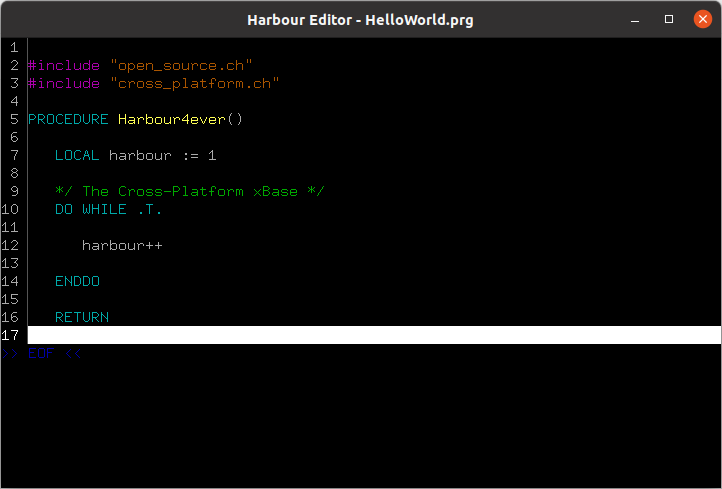

# Harbour Editor

Is a simple, free source code editor, written in the [Harbour](https://harbour.github.io/) programming language, open source.
This general purpose text editor aims at simplicity and ease of use. The major plus point of using the Harbour Editor is its
lightweight nature that makes sure that you can use it with ease on hardware with limited resources.
The project has an educational nature - the main goal is to expand knowledge in the field of creating the aplications with the usege of Harbour programing language.

The project is more compatible with Linux and derivatives.

#### Install

Clone an existing repository only fetching the 10 most recent commits on the default branch (useful to save time):

```
git clone --depth 10 https://github.com/rjopek/he
```

You can get subsequent updates using this command:

```
git pull
```

#### Build

```
cd he
hbmk2 he.hbp
```

Set up a "he" installation directory for your user account. The following commands will add environment variables to your file to configure the "he" installation path:

----

#### Linux

```
echo '' >> ~/.bashrc
echo '# Install Harbour Editor to ~/he' >> ~/.bashrc
echo 'export PATH="$HOME/he/bin/linux/gcc:$PATH"' >> ~/.bashrc
source ~/.bashrc
```

#### Windows

```
setx path "%path%;c:he\bin\win\mingw64"
```

#### Hello World

