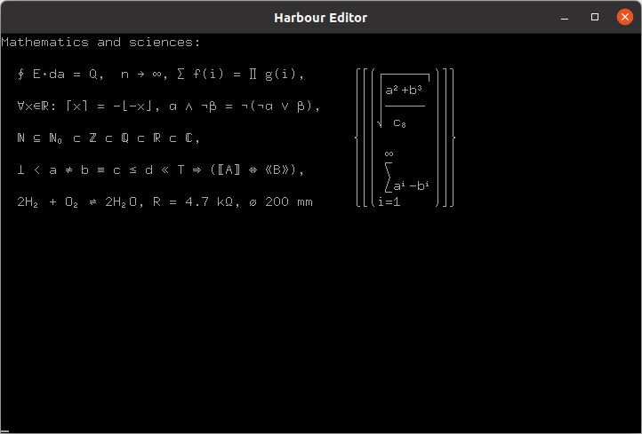
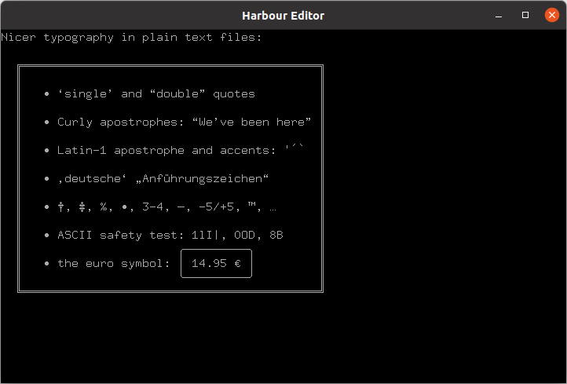
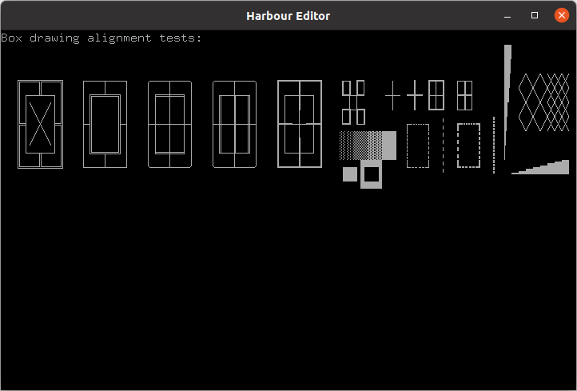
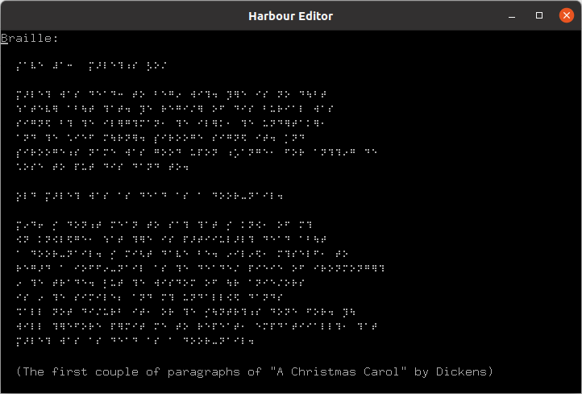
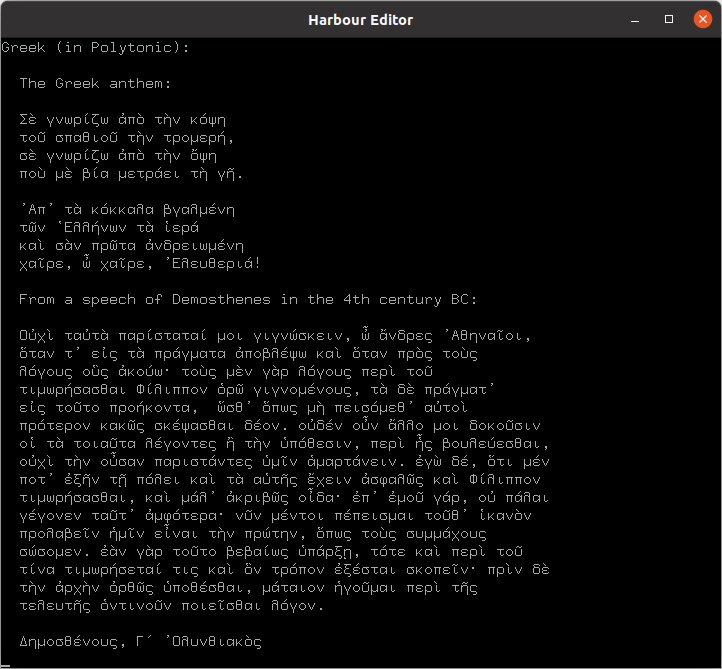
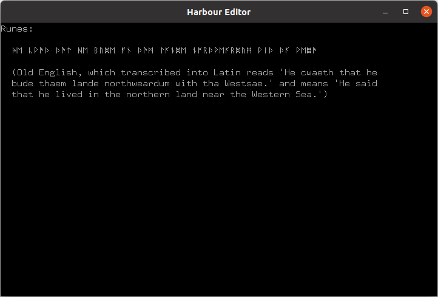
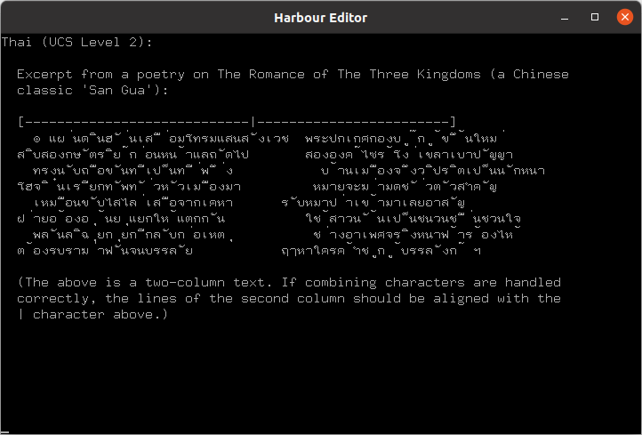
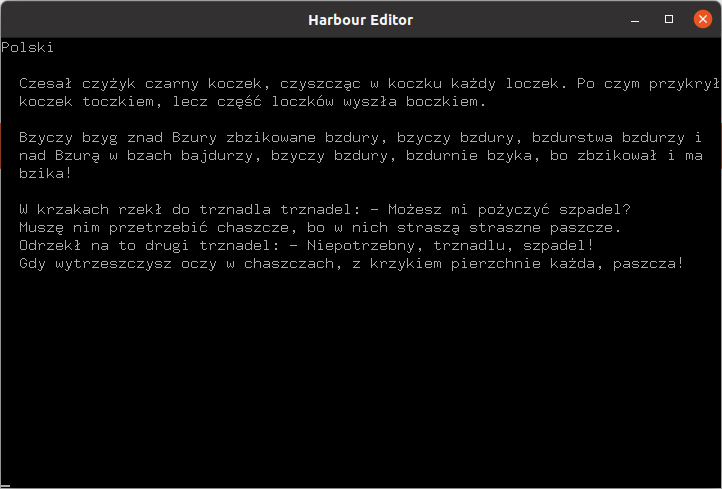
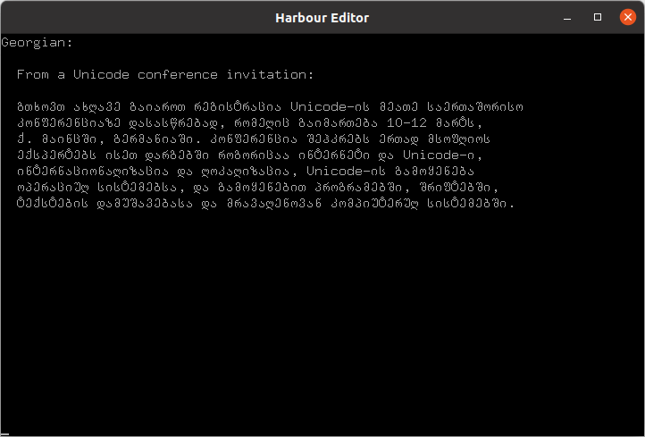
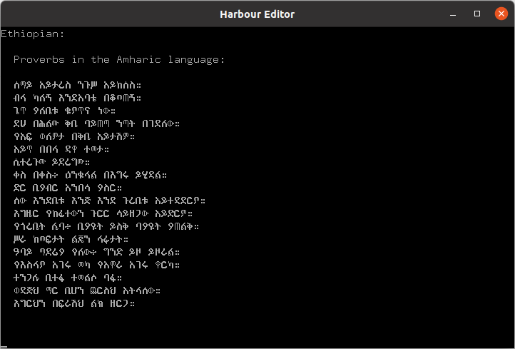

# **Harbour project extended xBase compiler**

**Harbour editor** - is a simple, free source code editor, written in Harbour, open source.

## Platforms

| OS      | Supported          |
|---------|--------------------|
| Mac     | [x] |
| Linux   | [x] |
| Windows | [x] |

## Example

UTF-8 encoded sample plain-text file.

The ASCII compatible UTF-8 encoding used in this plain-text file
is defined in Unicode, ISO 10646-1, and RFC 2279.

Using Unicode/UTF-8, you can write in source code things such as

#### Mathematics and sciences:

### Nicer typography in plain text files:

### Box drawing alignment tests:

### Braille:

### Greek (in Polytonic):

### Runes:

### Thai (UCS Level 2):

### Polski:

### Georgian:

### Ethiopian:

> &copy; 2021 Rafał Jopek