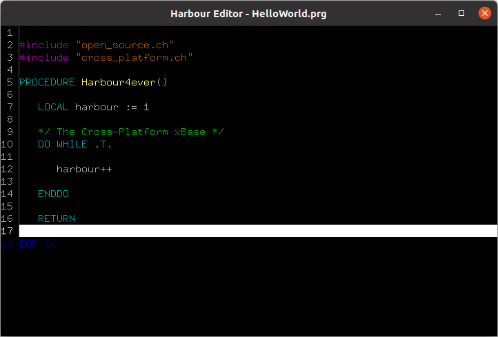

# **Harbour project extended xBase compiler**

**Harbour editor** - is a simple, free source code editor, written in the [Harbour](https://harbour.github.io/) programming language, open source.
This general purpose text editor aims at simplicity and ease of use. The major plus point of using the Harbour Editor is its
lightweight nature that makes sure that you can use it with ease on hardware with limited resources. The project has an educational nature - the main goal is to expand knowledge in the field of creating the aplications with the usege of Harbour programing language.

The project is more compatible with Linux and derivatives.

> - [Features](features "Features")
> - [Shortcuts](shortcuts "Shortcuts")
> - [Examples](examples "Examples")

#### Hello World

> &copy; 2021 Rafał Jopek